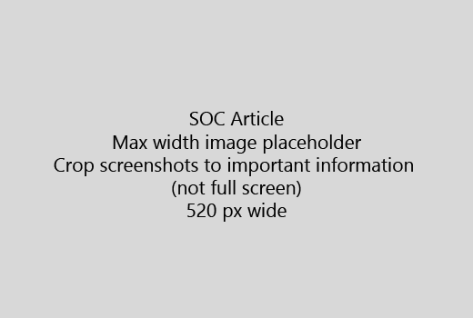

Începe articolul dumneavoastră cu o introducere foarte scurt (1 teză). Pune-te în locul cititorului - de ce sunt aici? Ceea ce trebuie să fac? 
  
1. Ajunge direct la o listă scurtă de paşi pentru a realiza sarcina.
    
    În cazul în care aveţi nevoie pentru a explica un concept, sau ce trebuie să faci paşi pre-condiţie, se adaugă un rezumat rapid pasul în cazul în care au nevoie, şi [link-ul](https://support.office.com/article/f37e7984-cf03-4fde-92d3-82970d7e241b.aspx) la conceptul sau paşii de mai jos. 
    
2. Păstraţi procedurile scurt - preferabil 5 sau mai puţine etape, cel mult 8.
    
3. Utilizaţi **stilul Ui** pentru elementele de interfaţă utilizator sau pentru text oamenii au nevoie pentru a intra. 
    
4. Utilizarea verbelor alege, selectaţi, sau introduceţi ca acţiunile şi format meniuri ca **meniu** \> **comanda**.
    
5. Opţional, adăugaţi un screenshot pentru contextul (în cazul în care UI este greu pentru a localiza, sau este nevoie pentru a finaliza sarcina).
    
    Lățimea maximă: 520 pixeli. Utilizaţi o temă standard, nu arată nici o informaţie personală, şi a culturilor pentru a afişa numai ceea ce este relevant. 
    
    
  
Dacă doriţi să adăugaţi un video sau screenshot, utilizaţi o grilă de două coloane şi au paşii din stânga şi pagina sau imaginea din dreapta - a se vedea [paşii şi pagina grila de exemplu](https://support.office.com/article/14ce8e82-efa0-47f5-bb84-94f078db3dae.aspx). 
  
Ţintă nu mai mult de 500 de cuvinte pentru un articol.
  
# Exemplu articol

[Schimba poza mea](https://support.office.com/article/555376e0-1fca-49ba-8434-307a0525c767.aspx)
  

