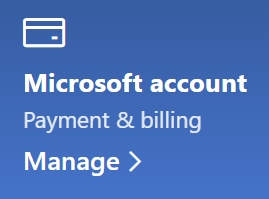

# Modificarea informațiilor contului Microsoft

Mergeți și [https://account.microsoft.com](https://account.microsoft.com/) conectați-vă, dacă este necesar. Aceasta vă va duce la tabloul de bord al contului.  

**Editarea numelui și informațiilor personale**

1. În tabloul de bord al contului, lângă imaginea de cont și numele dvs., faceți clic **pe Mai multe acțiuni > Editare profil.**
2. Pe pagina **Editați profilul,** utilizați linkurile furnizate pentru a schimba imaginea de profil, numele, data nașterii, locația și preferința lingvistică de afișare. Rețineți linkurile către profilurile contului xbox sau Skype, unde puteți modifica detaliile specifice acestor conturi.

**Gestionarea adreselor de e-mail și a numerelor de telefon**

Un cont Microsoft are una sau mai multe adrese de e-mail sau numere de telefon asociate ca "aliasuri". Pentru a le gestiona:

1. În tabloul de bord al contului, lângă imaginea de cont și numele dvs., faceți clic **pe Mai multe acțiuni > Editare profil.**
2. Pe pagina **Editați profilul,** faceți **clic pe Gestionați modul de conectare la Microsoft.** 
3. Veți vedea o listă de aliasuri de cont și veți putea gestiona lista, inclusiv adăugarea și ștergerea adreselor de e-mail și a numerelor de telefon. Aici puteți selecta, de asemenea, ce aliasuri pot fi utilizate pentru a vă conecta la cont și ce alias este considerat "principal", care se va afișa pe dispozitivele Windows 10.

**Gestionați metodele de plată, precum și numele și adresa pentru facturare** 

1. În tabloul de bord al contului, lângă imaginea de cont și numele dvs., faceți clic **pe Mai multe acțiuni > Editare profil.**
2. Sub **Plată & facturare, faceți** clic **pe Gestionare.**

    

3. Aici puteți să adăugați, să editați și să eliminați metode de plată și adresele lor de facturare asociate. 
