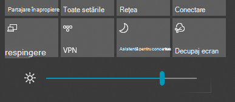

# Modificați luminozitatea ecranului în Windows 10

Dacă versiunea Windows 10 este mai nouă decât versiunea 1903, aceasta are un **glisor** Luminozitate în centrul Acțiuni. Pentru a deschide centrul  Acțiuni, faceți clic pe butonul Notificare din extremitatea dreaptă a barei de activități sau apăsați **pe Windows pornire + A** pe tastatură.

Dacă versiunea Windows 10 este o versiune anterioară, puteți găsi cursorul de luminozitate, dacă vă **[Setări > pe > Afișare](ms-settings:display?activationSource=GetHelp)**.

**Note:**

- Este posibil să nu vedeți glisorul Modificați luminozitatea pentru ecranul încorporat de pe PC-urile desktop care au un monitor extern. Pentru a modifica luminozitatea unui monitor extern, utilizați controalele de pe monitor.
- Dacă nu aveți un PC desktop și cursorul nu apare sau nu funcționează, încercați să actualizați driverul de afișare. În caseta de căutare din bara de activități, **tastați Manager dispozitive**, apoi selectați Manager **dispozitive** din lista de rezultate. În **Manager dispozitive**, selectați Plăci **video**, apoi selectați adaptorul de afișare. Apăsați și țineți apăsat (sau faceți clic dreapta) pe numele plăcii video și faceți clic **pe Actualizare driver**; apoi urmați instrucțiunile.
