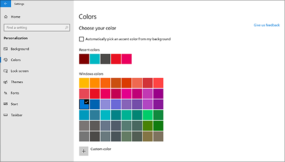
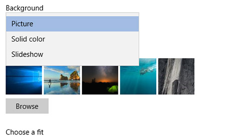

# Modificarea fundalului și culorilor pentru desktopChange your desktop background and colors

Pentru a modifica setarea culorilor, accesați culori de personalizare a **Start**  >  **setărilor**  >  **Personalization**  >  **Colors**de pornire, apoi alegeți culoarea proprie sau permiteți Windows să tragă o culoare de accent din fundal.To change your colors setting, go to **Start** > **Settings** > **Personalization** > **Colors**, and then choose your own color or let Windows pull an accent color from your background.

Pentru a vă schimba fundalul pentru desktop **Start**, accesați fundal de personalizare a  >  **setărilor**  >  **Personalization**  >  **Background**de pornire, apoi alegeți o imagine, o culoare solidă sau creați o expunere de diapozitive cu imagini.To change your desktop background, go to **Start** > **Settings** > **Personalization** > **Background**, and then choose a picture, solid color, or create a slideshow of pictures. 

Doriți mai multe fundaluri și culori pentru desktop?Want more desktop backgrounds and colors? Vizitați [Magazinul Microsoft](https://www.microsoft.com/store/collections/windowsthemes) pentru a alege din zeci de teme gratuite.Visit [Microsoft Store](https://www.microsoft.com/store/collections/windowsthemes) to choose from dozens of free themes.
