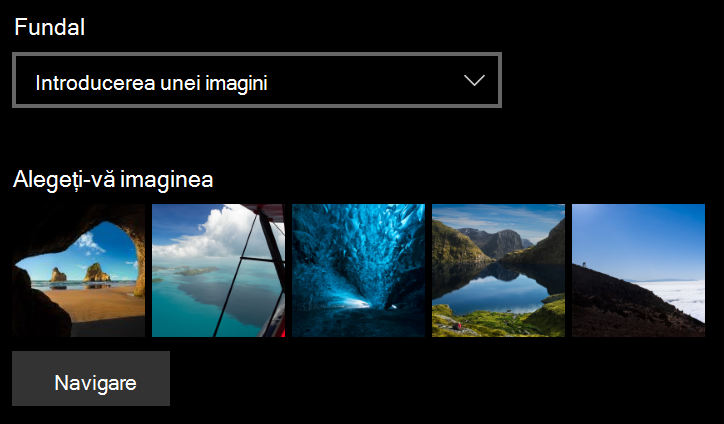
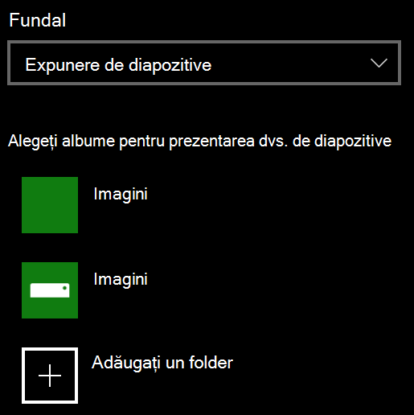

# Modificarea fundalului ecranului de blocare

- Accesați **Ecranul** >  **de blocare****personalizare setări** >. Sau faceți clic sau atingeți [aici](ms-settings:lockscreen?activationSource=GetHelp).

- Pentru a seta o imagine de fundal particularizată, selectați **Imagine** din lista verticală **Fundal** și alegeți sau **Navigați** la imagine.

  

- Pentru a configura o expunere de diapozitive cu imagini particularizate, selectați **Expunere** de diapozitive din lista verticală **Fundal** și alegeți un album sau adăugați un folder care conține imaginile pentru expunerea de diapozitive.

  
