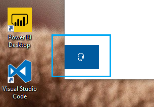

# Contactati-ne făcând clic pe butonul căști

Dacă doriți să contactați asistența Microsoft, faceți clic pe **Contactați-ne** în colțul din stânga jos al acestei aplicații. În interiorul ferestrei de zbor, vei fi ghidat către canalul de asistență din dreapta după ce alegi produsul și categoria de probleme.

Puteți continua să interacționați cu restul aplicației chiar și după ce ați inițiat o sesiune Contactați-ne. Panoul Contactați-ne poate fi minimizat temporar făcând clic oriunde altundeva în interiorul aplicației. Pentru a reveni la aceeași sesiune, faceți clic din nou pe **Contactați-ne.**
