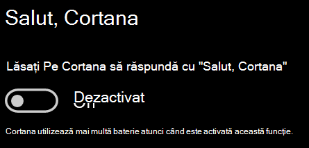

# Cortana nu vorbește cu mine sau nu mă poate auziCortana doesn’t talk to me or can’t hear me

Dacă încercați să utilizați caracteristica "Hey Cortana", care vă permite să vorbiți cu Cortana fără a selecta butonul Cortana din bara de activități sau butonul microfon din panoul Cortana, confirmați că caracteristica este activată:If you are trying to use the "Hey Cortana" feature, which allows you to talk to Cortana without selecting the Cortana button on the taskbar or the microphone button in the Cortana panel, confirm that the feature is enabled:

1. Accesați **Start**, apoi **[selectați Setări > Cortana](ms-settings:cortana?activationSource=GetHelp)**.Go to **Start**, then select **[Settings > Cortana](ms-settings:cortana?activationSource=GetHelp)**.
2. Sub **Hey Cortana**, comutați comutatorul **Permiteți Cortana să răspundă la "Hey Cortana"** la **Activat**.Under **Hey Cortana**, switch the **Let Cortana respond to "Hey Cortana"** toggle to **On**.

**Setările de confidențialitate împiedică Cortana să vă audă?****Are your privacy settings preventing Cortana from hearing you?**

Setările de confidențialitate pot împiedica Cortana să răspundă la vocea dvs.Your privacy settings can prevent Cortana from responding to your voice.
- Verificați dacă este activată recunoașterea vorbirii online:Check to make sure Online Speech recognition is turned on:
    - Accesați **Start**, apoi faceți clic pe **[Setări > vorbire > de confidențialitate](ms-settings:privacy-speech?activationSource=GetHelp)**.Go to **Start**, then click **[Settings > Privacy > Speech](ms-settings:privacy-speech?activationSource=GetHelp)**.
    - Sub **Recunoaștere vorbire online**, comutați setarea la **Activat**.Under **Online speech recognition**, switch the setting to **On**.
- Verificați dacă Cortana are permisiunea de a vă accesa microfonul.Check to make sure Cortana has permission to access your microphone. 
    - Accesați Start, apoi faceți clic pe **[Setări > Confidențialitate > Microfon](ms-settings:privacy-microphone?activationSource=GetHelp)**.Go to Start, then click **[Settings > Privacy > Microphone](ms-settings:privacy-microphone?activationSource=GetHelp)**.
    - Sub **Alegeți ce aplicații vă pot accesa microfonul**, căutați **Cortana** în lista de aplicații și servicii și asigurați-vă că comutatorul este comutat la **Activat**.Under **Choose which apps can access your microphone**, look for **Cortana** within the list of apps and services and make sure the switch is toggled to **On**.

În plus, asigurați-vă, de asemenea, că difuzoarele sau microfoanele sunt pornite și funcționează pentru a discuta cu Cortana.Moreover, please also make sure that your speakers or microphones are up and working in order to talk to Cortana.
