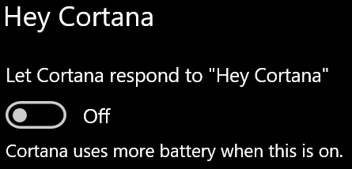

# Cortana nu vorbește cu mine sau nu mă poate auzi

Dacă încercați să utilizați caracteristica "Salut Cortana", care vă permite să vorbiți cu Cortana fără să selectați butonul Cortana de pe bara de activități sau butonul de microfon din panoul Cortana, confirmați că această caracteristică este activată:

1. Accesați **Start**, apoi selectați **[Setări > Cortana](ms-settings:cortana?activationSource=GetHelp)**.
2. Sub **Salut Cortana**, comutați Permiteți ca Cortana să răspundă la **"Salut Cortana"** la **Pornit**.

**Setările de confidențialitate vă împiedică Cortana vă audă?**

Setările de confidențialitate vă pot Cortana să răspundă la vocea dvs.
- Asigurați-vă că recunoașterea vorbirii în online este activată:
    - Accesați **Start , apoi** faceți clic pe **[Setări > de > Vorbire.](ms-settings:privacy-speech?activationSource=GetHelp)**
    - Sub **Recunoașterea vorbirii online**, comutați setarea la **Pornit**.
- Asigurați-vă că Cortana permisiunea de a accesa microfonul. 
    - Accesați Start, apoi faceți clic **[pe Setări > confidențialitate > Microfon](ms-settings:privacy-microphone?activationSource=GetHelp)**.
    - Sub **Alegeți ce** aplicații vă pot accesa microfonul , căutați-Cortana în lista de aplicații și servicii și asigurați-vă că comutatorul este  **comutat** la Activat .

În plus, vă rugăm, de asemenea, să vă asigurați că difuzoarele sau microfoanele sunt sus și funcționează pentru a vorbi Cortana.
