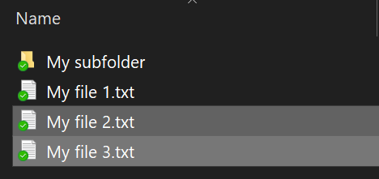
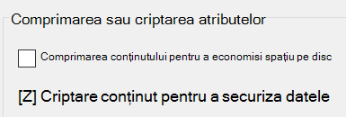

# Criptarea fișierelor sau folderelor din Windows 10

Puteți cripta un disc întreg utilizând BitLocker, dar pentru a cripta doar fișiere sau foldere individuale (și conținutul acestora):

1. În **Explorer,** selectați fișierele/folderele pe care doriți să le criptați. În acest exemplu, au fost selectate două fișiere:

    

2. Faceți clic dreapta pe fișierele selectate și faceți clic **pe Proprietăți.**

3. În fereastra **Proprietăți,** faceți clic **pe Complex.**

4. În fereastra **Proprietăți complexe,** bifați caseta de **selectare Criptare conținut pentru a securiza** datele:

    

5. Faceți clic pe **OK**.
