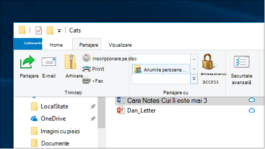
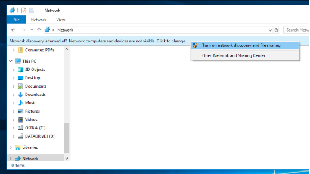

# Partajarea fișierelor printr-o rețea în Windows 10

**Notă**: dacă ați utilizat anterior HomeGroup pentru partajarea fișierelor, rețineți că grupul de domiciliu a fost eliminat din Windows 10 (versiunea 1803). Acum puteți partaja imprimante și fișiere utilizând caracteristici predefinite în Windows 10.

**Pentru a partaja fișiere sau foldere dintr-o rețea**

- În **Explorer**, selectați un fișier > faceți clic pe fila **Partajare** din partea de sus > din secțiunea **Partajare cu** , faceți clic pe **anumite persoane**.

    
          
- Dacă selectați mai multe fișiere simultan, le puteți partaja pe toate în același mod. Funcționează și pentru foldere.

**Pentru a vedea dispozitivele din rețeaua care partajează fișiere**

- În **Explorer**, accesați **Network**. Dacă descoperirea rețelei nu este activată, veți vedea un mesaj de eroare "descoperirea rețelei este dezactivată..."

- Faceți clic pe pictograma **descoperire rețea este dezactivată** banner, apoi faceți clic **pe Activare descoperire rețea și partajare fișiere**.

    

[Citiți mai multe despre partajarea fișierelor într-o rețea](https://support.microsoft.com/help/4092694/windows-10-file-sharing-over-a-network)

[Partajați fișiere utilizând aplicații, OneDrive, e-mailuri și altele](https://support.microsoft.com/help/4027674/windows-10-share-files-in-file-explorer)
