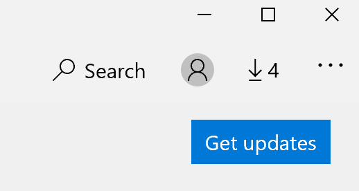

# Remedierea limbii de afișare a aplicațiilor

După ce modificați limba de afișare în Windows 10, unele aplicații pot utiliza în continuare limba anterioară atunci când le deschideți. Acest lucru se întâmplă deoarece noile versiuni ale aplicațiilor pentru acea limbă trebuie descărcate din Magazin. Pentru a remedia această problemă, puteți fie să așteptați actualizarea automată, fie să instalați manual versiunea actualizată a aplicațiilor.

Pentru a instala manual actualizarea, deschideți **Microsoft Store** și faceți clic pe Descărcări **și actualizări** în colțul din dreapta sus. Apoi faceți clic pe **Obținere actualizări**. Dacă limba nu se modifică după terminarea actualizării, încercați să reporniți PC-ul.

Pentru a citi mai multe despre setările de limbă de intrare și de afișare, consultați [Gestionarea setărilor de limbă de intrare și de afișare în Windows 10](https://support.microsoft.com/help/4027670/windows-10-add-and-switch-input-and-display-language-preferences).
