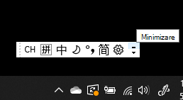
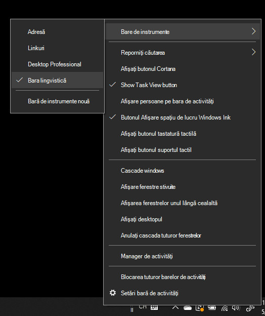
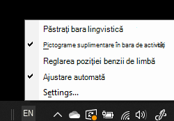

# Ascunderea, afișarea sau reinițializarea barei lingvisticeHide, display, or reset the language bar

**Pentru a minimiza bara lingvistică:****To minimize the language bar:**

Aveți posibilitatea să faceți clic pe butonul Minimizare în colțul din dreapta sus al barei lingvistice.You can click the minimize button on the top right corner of the language bar. Sau puteți glisa pur și simplu bara lingvistică în bara de activități, ceea ce o va minimiza automat.Or, you can just drag the language bar to the task bar, which will automatically minimize it.

**Pentru a apărea bara lingvistică:****To pop out the language bar:**

Dacă nu doriți să andocate bara lingvistică în bara de activități, faceți  clic dreapta pe orice spațiu liber din bara de activități și debifați opțiunea Bara lingvistică din meniul Bare de instrumente.If you don't want to dock the language bar in the taskbar, right-click any empty space in the taskbar, and uncheck the **Language bar** option in the Toolbars menu. Acest lucru va face bara lingvistică să apară în afara barei de activități, la fel ca în captura de ecran anterioară.This will make the language bar appear outside the taskbar, just like the previous screenshot.

**Pentru a restaura bara lingvistică la valoarea implicită:****To restore the language bar to default:**

Faceți clic dreapta pe butonul pentru limbă din bara de instrumente și faceți **clic pe Restaurați opțiunea Bară** lingvistică din meniu.Right-click the language button in the toolbar, and click **Restore the language bar** option in the menu. Aceasta îl va restaura la valoarea implicită.This will restore it to default.

