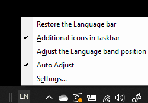

# Ascunderea, afișarea sau reinițializarea barei lingvistice

**Pentru a minimiza bara lingvistică:**

Aveți posibilitatea să faceți clic pe butonul Minimizare în colțul din dreapta sus al barei lingvistice. Sau puteți glisa pur și simplu bara lingvistică în bara de activități, ceea ce o va minimiza automat.

**Pentru a apărea bara lingvistică:**

Dacă nu doriți să andocate bara lingvistică în bara de activități, faceți  clic dreapta pe orice spațiu liber din bara de activități și debifați opțiunea Bara lingvistică din meniul Bare de instrumente. Acest lucru va face bara lingvistică să apară în afara barei de activități, la fel ca în captura de ecran anterioară.

**Pentru a restaura bara lingvistică la valoarea implicită:**

Faceți clic dreapta pe butonul pentru limbă din bara de instrumente și faceți **clic pe Restaurați opțiunea Bară** lingvistică din meniu. Aceasta îl va restaura la valoarea implicită.

