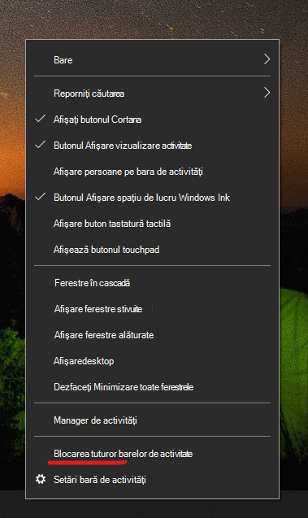

# Mutați bara de activități în oricare parte sau în partea de sus a desktopuluiMove the taskbar to either side or the top of your desktop

Mai întâi, confirmați că bara de activități este deblocată.First, please confirm that the taskbar is unlocked. Pentru a afla dacă dispozitivul dvs. este deblocat, faceți  clic dreapta pe orice spațiu gol din bara de activități și vedeți dacă Blocarea barei de activități are un marcaj de selectare lângă aceasta.To find out whether yours is unlocked, right-click any empty space on the taskbar and see whether **Lock the taskbar** has a checkmark next to it. Dacă există un marcaj de selectare, bara de activități este blocată și nu poate fi mutată.If there is a checkmark, the taskbar is locked and cannot be moved. Dacă faceți clic **pe Blocare bară de activități** o dată, se va debloca și se va elimina bifa.Clicking **Lock the taskbar** once will unlock it and remove the checkmark.

Dacă aveți mai multe monitoare care afișează bara de activități, veți vedea **Blocați toate barele de activități**.If you have multiple monitors that display the taskbar, you will see **Lock all taskbars**.

După ce se deblochează bara de activități, puteți să apăsați și să mențineți apăsat orice spațiu liber din bara de activități și să îl glisați în locația dorită pe ecran.Once the taskbar is unlocked, you can press and hold any empty space on the taskbar and drag it to the location you want on the screen. De asemenea, puteți face acest lucru făcând clic dreapta pe orice spațiu gol din bara de activități și accesând setările barei de ** activități > locația barei de activități pe ecran**.You can also do so by right-clicking on any empty space on the taskbar and go to **[Taskbar settings](ms-settings:taskbar?activationSource=GetHelp) > Taskbar location on screen**.
