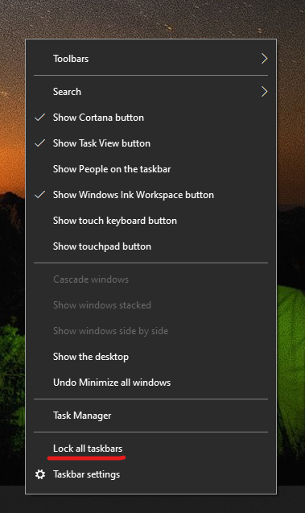

# Mutați bara de activități în oricare parte sau în partea de sus a desktopului

Mai întâi, confirmați că bara de activități este deblocată. Pentru a afla dacă dispozitivul dvs. este deblocat, faceți  clic dreapta pe orice spațiu gol din bara de activități și vedeți dacă Blocarea barei de activități are un marcaj de selectare lângă aceasta. Dacă există un marcaj de selectare, bara de activități este blocată și nu poate fi mutată. Dacă faceți clic **pe Blocare bară de activități** o dată, se va debloca și se va elimina bifa.

Dacă aveți mai multe monitoare care afișează bara de activități, veți vedea **Blocați toate barele de activități**.

După ce se deblochează bara de activități, puteți să apăsați și să mențineți apăsat orice spațiu liber din bara de activități și să îl glisați în locația dorită pe ecran. De asemenea, puteți face acest lucru făcând clic dreapta pe orice spațiu gol din bara de activități și accesând setările barei de ** activități > locația barei de activități pe ecran**.
