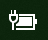

# Pictograma alimentare sau baterie lipsește în Windows 10

Dacă dispozitivul dvs. Windows 10 are baterie (de exemplu, un laptop, o tabletă sau un PC conectat prin USB la un UPS), în mod normal, în bara de activități se afișează o pictogramă alimentare/baterie lângă ceas, de exemplu:

Dacă nu vedeți această pictogramă, este posibil să fie ascunsă:

1. Accesați **[Setări > Personalizare > Bară de activități](ms-settings:taskbar?activationSource=GetHelp)**.

2. În Zona de notificare, faceți clic pe **Selectați ce pictograme apar în bara de activități**.

3. Apoi găsiți elementul **Alimentare** din listă și treceți setarea sa la **Activată**.

    

**Depanare**

Dacă urmați instrucțiunile de mai sus și butonul de comutare **Alimentare** este estompat sau nu este vizibil, în caseta de căutare de pe bara de activități, tastați **manager de dispozitive**, apoi selectați **Manager de dispozitive** în lista de rezultate. La **Baterii**, faceți clic dreapta pe baterie pentru dispozitivul dvs., faceți clic pe **Dezactivare**, apoi pe **Da**. Așteptați câteva secunde, apoi faceți clic dreapta pe baterie și faceți clic pe **Activare**. Apoi reporniți-vă dispozitivul.

Dacă urmați instrucțiunile de mai sus, însă pictograma baterie nu se afișează pe bara de activități, în caseta de căutare de pe bara de activități, tastați **manager de activități**, apoi faceți clic pe **Manager de activități** în lista de rezultate. În fila **Procese**, la **Nume**, faceți clic dreapta pe **Explorer**, apoi faceți clic pe **Repornire**.
