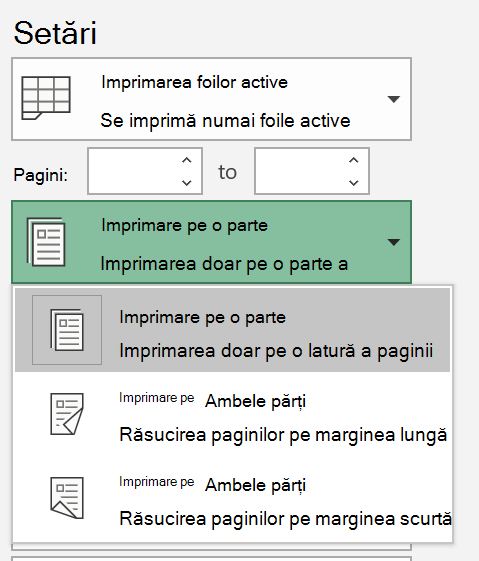

# Imprimarea pe ambele fețe ale hârtiei (imprimare duplex)Printing on both sides of paper (duplex printing)

**Imprimanta mea este capabilă de imprimare duplex?****Is my printer capable of duplex printing?**

Rezumatul sau manualul de caracteristici al imprimantei trebuie să vă spună dacă este capabil să imprime pe ambele fețe ale hârtiei, denumită și "imprimare duplex".Your printer’s feature summary or manual should tell you whether it is capable of printing on both sides of the paper, also known as “duplex printing.” Dacă aveți Microsoft Office, o altă modalitate de a afla este să deschideți o aplicație Office, cum ar fi Word sau Excel, să accesați **fișierul > imprimare**, asigurându-vă că este selectată imprimanta potrivită și căutați capacitatea în secțiunea Setări.If you have Microsoft Office, another way to find out is by opening an Office app like Word or Excel, going to **File > Print**, making sure the right printer is selected, and looking for the capability in the Settings section. De exemplu:For example: 

**Imprimarea duplex în Microsoft Office****Duplex printing in Microsoft Office**

Dacă imprimanta este capabilă să imprime pe ambele părți, când accesați **fișierul > imprimați** în aplicația Office, veți vedea o opțiune de "imprimare pe ambele părți", așa cum se arată în exemplul de mai sus.If your printer is capable of printing on both sides, when you go to **File > Print** in the Office app, you will see an option to “Print on Both Sides,” as shown in the example above.  Selectați tipul de imprimare duplex dorită (răsturnare pe muchie lungă sau răsturnare pe margine scurtă) și faceți clic pe **imprimare** pentru a porni imprimarea.Select the type of duplex printing you want (flip on long edge, or flip on short edge), and click **Print** to start the printout.

**Imprimarea duplex din orice aplicație****Duplex printing from any application**

În multe aplicații atunci când imprimați, veți vedea o casetă de dialog Imprimare generală care arată astfel:In many apps when you print you will see a general print dialog that looks like this: 

Asigurați-vă că este selectată imprimanta potrivită, apoi faceți clic pe **Preferințe** pentru a deschide fereastra Preferințe imprimantă.Make sure the right printer is selected, then click **Preferences** to open the printer preferences window. Dacă imprimanta este capabilă să imprime duplex, capacitatea de a activa aceasta pentru lucrarea de imprimare curentă se va afișa în acea fereastră.If the printer is capable of duplex printing, the ability to enable this for the current print job will show in that window.
