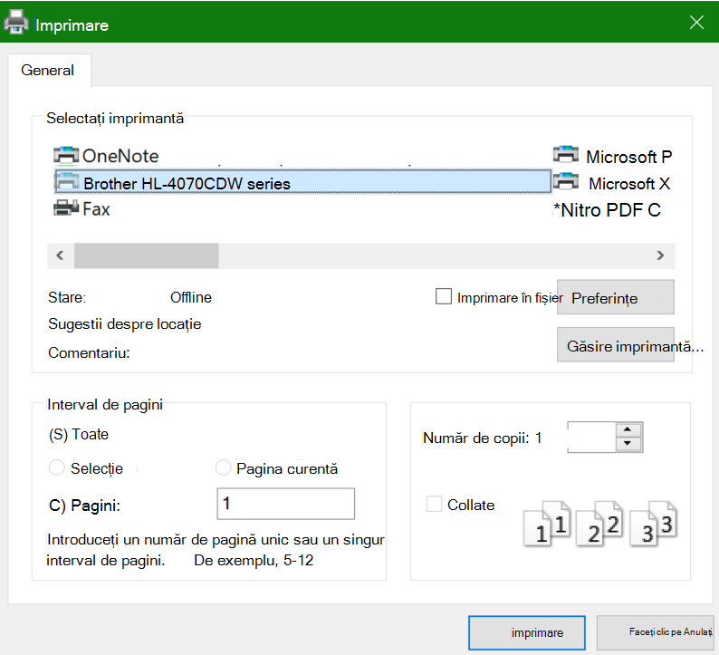

# Imprimarea pe ambele părți ale hârtiei (imprimare duplex)Printing on both sides of paper (duplex printing)

**Imprimanta mea poate fi imprimare duplex?****Is my printer capable of duplex printing?**

Rezumatul caracteristicii sau manualul imprimantei ar trebui să vă spună dacă poate imprima pe ambele fețe ale hârtiei, numită și "imprimare duplex".Your printer’s feature summary or manual should tell you whether it is capable of printing on both sides of the paper, also known as “duplex printing.” Dacă aveți Microsoft Office, o altă modalitate de a afla este să deschideți o aplicație Office, cum ar fi Word sau Excel, să mergeți la Fișier **> Imprimare**, asigurându-vă că este selectată imprimanta corectă și căutând capacitatea în secțiunea Setări.If you have Microsoft Office, another way to find out is by opening an Office app like Word or Excel, going to **File > Print**, making sure the right printer is selected, and looking for the capability in the Settings section. De exemplu:For example: 

**Imprimare duplex în Microsoft Office****Duplex printing in Microsoft Office**

Dacă imprimanta poate imprima pe ambele părți, atunci când accesați Fișier **>** Imprimare în aplicația Office, veți vedea o opțiune "Imprimare pe ambele părți", așa cum se arată în exemplul de mai sus.If your printer is capable of printing on both sides, when you go to **File > Print** in the Office app, you will see an option to “Print on Both Sides,” as shown in the example above.  Selectați tipul de imprimare duplex dorită (întoarceți-vă pe  marginea lungă sau răsturnați pe marginea scurtă) și faceți clic pe Imprimare pentru a porni imprimarea.Select the type of duplex printing you want (flip on long edge, or flip on short edge), and click **Print** to start the printout.

**Imprimare duplex din orice aplicație****Duplex printing from any application**

În multe aplicații, atunci când imprimați, veți vedea o casetă de dialog de imprimare generală care arată astfel:In many apps when you print you will see a general print dialog that looks like this: 

Asigurați-vă că este selectată imprimanta corectă, apoi **faceți clic pe Preferințe** pentru a deschide fereastra de preferințe pentru imprimantă.Make sure the right printer is selected, then click **Preferences** to open the printer preferences window. Dacă imprimanta este capabilă să imprime duplex, capacitatea de a activa aceasta pentru activitatea curentă de imprimare se va afișa în acea fereastră.If the printer is capable of duplex printing, the ability to enable this for the current print job will show in that window.
