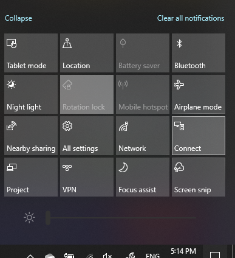

# Proiect pe un PCProject to a PC

Pe dispozitivul de destinație (proiectare pe), căutați "Setări proiecție" pentru a deschide pagina Setări **proiectare pe acest PC**.On your destination device (projecting to), search for "Projection Settings" to open the Settings page of **Projecting to this PC**. Apoi asigurați-vă că:Then make sure that:
- Meniul vertical "Unele dispozitive Windows și Android pot proiecta pe acest PC atunci când spuneți că este ÎN REGULĂ" este setat la **Dezactivat întotdeauna**."Some Windows and Android devices can project to this PC when you say it's OK" drop-down menu is set to **Always Off**.
- Meniul vertical "Solicitați să proiectați pe acest PC" este setat la De **fiecare dată când este necesară o conexiune.**"Ask to project to this PC" drop-down menu is set to **Every time a connection is required**.
- Meniul vertical "Solicitați codul PIN pentru asociere" este setat la **Niciodată.**"Require PIN for pairing" drop-down menu is set to **Never**.

Pe dispozitivul de destinație, lansați **aplicația** Conectare accesând **Start** și căutați "Conectare".On your destination device, launch **Connect** app by going to **Start** and search for "Connect".

Apoi, pe dispozitivul sursă de pe care încercați să proiectați:Then, on your source device that you are trying to project from:

1. Apăsați **tasta Windows + A** pentru a deschide Centrul Acțiuni.Press **Windows key + A** to open Action Center.
2. Faceți **clic pe Conectare.**Click **Connect**.
3. Faceți clic pe dispozitivul pe care doriți să proiectați ecranul.Click the device you want to project the screen to.

După pașii de mai sus, dispozitivul dvs. de destinație ar trebui să afișeze ecranul dispozitivului sursă ca și cum ar fi un monitor secundar.After the above steps, your destination device should display the screen of the source device as if it is a secondary monitor.
