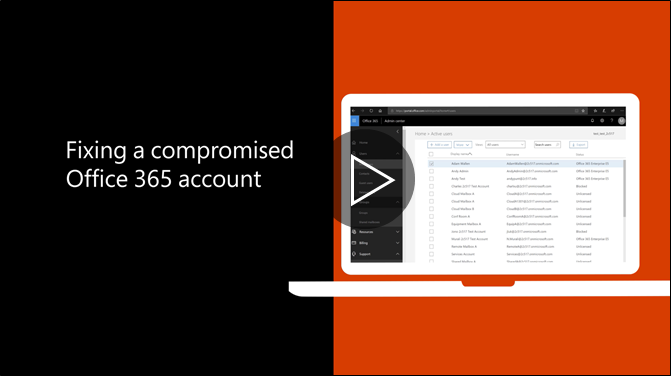

# Recomandat de paşi pentru a lua în cazul în care un cont este compromisăRecommended steps to take if an account is compromised

  
1. [Resetare parola utilizatorului](https://support.office.com/article/7a5d073b-7fae-4aa5-8f96-9ecd041aba9c) imediat. Comunica noua parolă prin e-mail la utilizatorul final.[Reset the user's password](https://support.office.com/article/7a5d073b-7fae-4aa5-8f96-9ecd041aba9c) immediately. Do not communicate the new password through email to the end user. 
    
2. Elimina orice suspect [adrese de expediere](https://support.office.com/article/ab5eb117-0f22-4fa7-a662-3a6bdb0add74) la nivelul cutiei poştale.Remove any suspicious [forwarding addresses](https://support.office.com/article/ab5eb117-0f22-4fa7-a662-3a6bdb0add74) set at the mailbox level. 
    
3. Elimina orice suspect de [reguli inbox](https://support.office.com/article/1433E3A0-7FB0-4999-B536-50E05CB67FED) în cutia poştală.Remove any suspicious [inbox rules](https://support.office.com/article/1433E3A0-7FB0-4999-B536-50E05CB67FED) set within the mailbox. 
    
4. În cazul în care utilizatorul este blocat la trimiterea de e-mail, [accesați utilizatori restricţionat pentru a debloca contul](https://protection.office.com/?hash=/restrictedusers). Odată terminat, utilizatorul ar trebui să fie capabil să-şi reia trimiterea de mesaje în cadrul 1 oră.If the user is blocked from sending email, [go to the Restricted Users to unblock the account](https://protection.office.com/?hash=/restrictedusers). Once done, the user should be able to resume sending messages within 1 hour.
    
5. Eliminaţi contul de utilizator de orice [grupuri de roluri administrative](https://support.office.com/article/eac4d046-1afd-4f1a-85fc-8219c79e1504) până când sunteţi sigur că contul nu mai este compromisă.Remove the user account from any [administrative role groups](https://support.office.com/article/eac4d046-1afd-4f1a-85fc-8219c79e1504) until you are confident that the account is no longer compromised. 
    
Pentru a minimiza potenţialul de o încălcare de date sau un cont compromise în viitor, vă recomandăm lectură nostru [Office 365 de securitate cele mai bune practici articolul](https://support.office.com/article/9295e396-e53d-49b9-ae9b-0b5828cdedc3).To minimize the potential of a data breach or a compromised account in the future, we recommend reading our [Office 365 Security best practices article](https://support.office.com/article/9295e396-e53d-49b9-ae9b-0b5828cdedc3).
  

