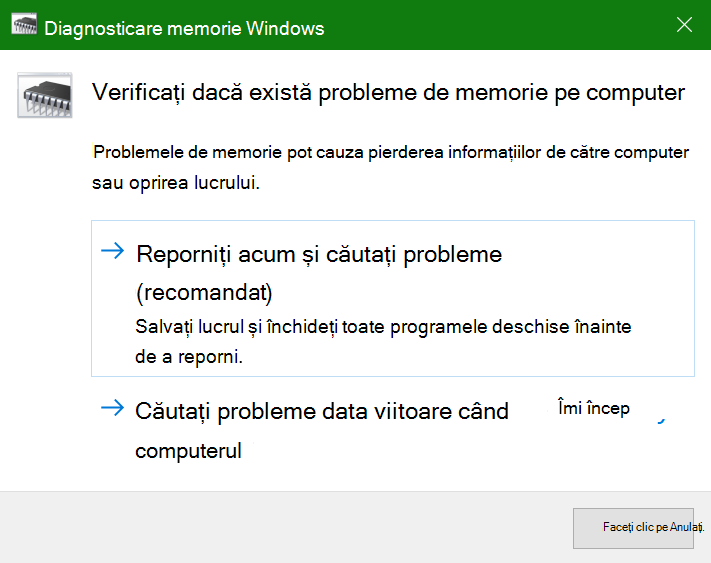
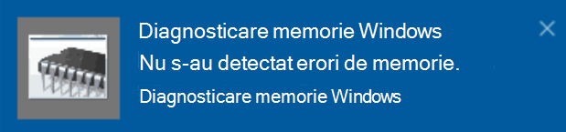

# Rulați Diagnostice memorie Windows în Windows 10Run Windows Memory Diagnostics in Windows 10

Dacă Windows și aplicațiile de pe PC se blochează, îngheașează sau acționează într-un mod instabil, este posibil să aveți o problemă cu memoria PC-ului (RAM).If Windows and apps on your PC are crashing, freezing, or acting in an unstable manner, you may have a problem with the PC’s memory (RAM). Puteți rula Diagnostic memorie Windows pentru a căuta probleme cu RAM-ul PC-ului.You can run the Windows Memory Diagnostic to check for problems with the PC’s RAM.

În caseta de căutare din bara de activități, tastați **diagnostic de memorie**, apoi selectați Diagnosticare memorie **Windows**.In the search box on your taskbar, type **memory diagnostic**, and then select **Windows Memory Diagnostic**. 

Pentru a rula diagnosticarea, PC-ul trebuie să repornească.To run the diagnostic, the PC needs to restart. Aveți opțiunea să reporniți imediat (salvați-vă lucrul și închideți mai întâi documentele și mesajele de e-mail deschise) sau programați diagnosticarea să ruleze automat data următoare când PC-ul repornește:You have the option to restart immediately (please save your work and close open documents and e-mails first), or schedule the diagnostic to run automatically the next time the PC restarts:

Atunci când PC-ul repornește, **Instrumentul de diagnosticare a memoriei Windows** va rula automat.When the PC restarts, the **Windows Memory Diagnostics Tool** will run automatically. Starea și progresul se vor afișa pe măsură ce rulează diagnosticele și veți avea opțiunea de a anula diagnosticele apăsând tasta **ESC** pe tastatură.Status and progress will be displayed as the diagnostics run, and you have the option of cancelling the diagnostics by hitting the **ESC** key on your keyboard.

Atunci când diagnosticele sunt finalizate, Windows va porni normal.When the diagnostics are complete, Windows will start normally.
Imediat după repornire, atunci când apare Desktopul,  va apărea o notificare (lângă pictograma Acțiuni din bara de activități), pentru a indica dacă s-au găsit erori de memorie.Immediately after restart, when the Desktop appears, a notification will appear (next to the **Action Center** icon on the taskbar), to indicate whether any memory errors were found. De exemplu:For example:

Iată pictograma Acțiuni:Here's the Action Center icon:  

Și un exemplu de notificare:And a sample notification: 

Dacă nu vedeți notificarea,  puteți selecta pictograma Acțiuni  de pe bara de activități pentru a afișa Acțiuni și a vedea o listă de notificări prin care se poate defila.If you missed the notification, you can select the **Action Center** icon  on the taskbar to display the **Action Center** and see a scrollable list of notifications.

Pentru a revizui informațiile detaliate, **tastați eveniment** în caseta de căutare din bara de activități, apoi selectați **Vizualizator evenimente**.To review detailed information, type **event** into the search box on your taskbar, and then select **Event Viewer**. În panoul **din stânga** al Vizualizatorului de evenimente, navigați la **Jurnale Windows > Sistem**.In the **Event Viewer**’s left-hand pane, navigate to **Windows Logs > System**. În panoul din dreapta, scanați lista în timp ce priviți coloana **Sursă,** până când vedeți evenimente cu valoarea sursă **MemoryDiagnostics-Results.**In the right-hand pane, scan down the list while looking at the **Source** column, until you see events with Source value **MemoryDiagnostics-Results**. Evidențiați fiecare astfel de eveniment și vedeți informațiile despre rezultate în caseta de **sub fila General** de sub listă.Highlight each such event and see the result information in the box under the **General** tab below the list.
