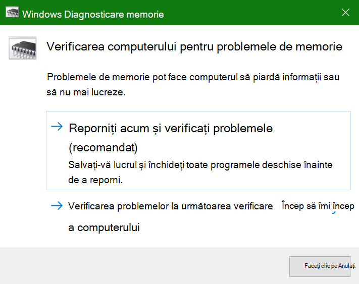

# Executarea diagnosticelor de memorie Windows în Windows 10

Dacă Windows și aplicațiile de pe PC se blochează, înghedează sau acționează într-un mod instabil, este posibil să aveți o problemă cu memoria PC-ului (RAM). Aveți posibilitatea să executați Windows Memory Diagnostic pentru a căuta probleme cu memoria RAM a PC-ului.

În caseta de căutare din bara de activități, tastați **diagnosticare memorie**, apoi selectați Diagnosticare **memorie Windows**. 

Pentru a executa diagnosticarea, PC-ul trebuie să repornească. Aveți opțiunea de a reporni imediat (vă rugăm să salvați lucrul și să închideți mai întâi documentele deschise și e-mailurile) sau să programați diagnosticarea să ruleze automat data viitoare când PC-ul repornește:

Când PC-ul repornește, **instrumentul de diagnosticare a memoriei Windows** se va executa automat. Starea și progresul vor fi afișate pe măsură ce se execută diagnosticarea și aveți opțiunea de a anula diagnosticarea apăsând tasta **ESC** de pe tastatură.

Când diagnosticarea este finalizată, Windows va porni normal.
Imediat după repornire, când apare Desktopul, va apărea o notificare (lângă pictograma **Centru de acțiune** din bara de activități), pentru a indica dacă s-au găsit erori de memorie. De exemplu:

Iată pictograma Centru de acțiune:  

Și o notificare eșantion: 

Dacă ați pierdut notificarea, puteți selecta pictograma **Centru de acțiune** din bara de activități pentru a afișa Centrul de **acțiune** și a vedea o listă de notificări derulantă.

Pentru a revizui informații detaliate, tastați **eveniment** în caseta de căutare din bara de activități, apoi selectați **Vizualizator evenimente**. În panoul din stânga vizualizatorului de **evenimente,** navigați la **Windows Logs > System**. În panoul din dreapta, scanați lista în timp ce căutați coloana **Sursă,** până când vedeți evenimente cu valoare sursă **MemoryDiagnostics-Results**. Evidențiați fiecare astfel de eveniment și vedeți informațiile despre rezultate în caseta de sub fila **General** de sub listă.
