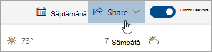

# Partajarea cu Outlook pe web

1. În partea de jos a paginii, selectați Calendar pentru a merge la Calendar.

2. În Calendar, în bara de instrumente din partea de sus a paginii, selectați **Partajare**și alegeți calendarul pe care doriți să îl partajați. 

    

    **Notă:** Nu puteți partaja calendare deținute de alte persoane.

3. Introduceți numele sau adresa de e-mail a persoanei cu care doriți să partajați calendarul.

4. Alegeți modul în care doriți ca persoana să vă utilizeze calendarul: 
    - **Poate vizualiza atunci când sunt ocupat**   le permite să vadă când ești ocupat, dar nu include detalii precum locația evenimentului. 
    - **Poate vizualiza titluri și locații**   le permite să vadă când ești ocupat, precum și titlul și locația evenimentelor. 
    - **Poate vizualiza toate detaliile**   le permite să vadă toate detaliile evenimentelor dvs. 
    - **Poate edita**   le permite să editeze calendarul. 
    - **Delegat**   le permite să editeze calendarul și să îl partajeze cu alte persoane.

5. Selectați **Partajare**. Dacă decideți să nu partajați calendarul chiar acum, selectați **Eliminare**. 

**Ia act de:**  

- Atunci când partajați calendarul cu o persoană care nu utilizează Outlook pe web, de exemplu, o persoană care utilizează Gmail, va putea accepta invitația numai utilizând un cont Microsoft 365 sau un cont Outlook.com. 

- Calendarele ICS sunt doar în citire, astfel încât, chiar dacă acordați acces la editare altor persoane, acestea nu vor putea edita calendarul. 

- Cât de des se sincronizează calendarul ICS depinde de furnizorul de e-mail al persoanei cu care l-ați partajat. 

- Elementele de calendar marcate private sunt protejate. Majoritatea persoanelor cu care partajați calendarul văd numai ora elementelor marcate private, nu și titlul, locația sau alte detalii. Seriile recurente marcate ca private vor afișa, de asemenea, modelul de recurență.
