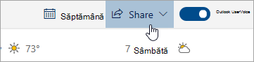

# Partajarea cu Outlook pe webSharing with Outlook on the web

Din Calendar, pe bara de instrumente din partea de sus a paginii, selectați **Partajare**și alegeți calendarul pe care doriți să îl partajați.From your Calendar, on the toolbar at the top of the page, select **Share**, and choose the calendar you want to share.

    

**Notă:** Nu puteți partaja calendare deținute de alte persoane.**Note**: You can't share calendars owned by other people.

- Introduceți numele sau adresa de e-mail a persoanei cu care doriți să partajați calendarul.Enter the name or email address of the person you want to share your calendar with.
- Alegeți modul în care doriți ca persoana să vă utilizeze calendarul:Choose how you want the person to use your calendar:
    - **Se poate vizualiza când sunt ocupat**   le permite să vadă când sunteți ocupat, dar nu include detalii precum locația evenimentului.**Can view when I'm busy** lets them see when you're busy but doesn't include details like the event location.
    - **Poate vizualiza titluri și locații**   le permite să vadă când sunteți ocupat, precum și titlul și locația evenimentelor.**Can view titles and locations** lets them see when you're busy, as well as the title and location of events.
    - **Poate vizualiza toate detaliile**   le permite să vadă toate detaliile evenimentelor.**Can view all details** lets them see all the details of your events.
    - **Se poate edita**   le permite să editeze calendarul.**Can edit** lets them edit your calendar.
    - **Delegat**   le permite să editeze calendarul și să îl partajeze cu alte persoane.**Delegate** lets them edit your calendar and share it with others.
- Selectați **Partajare**.Select **Share**.
