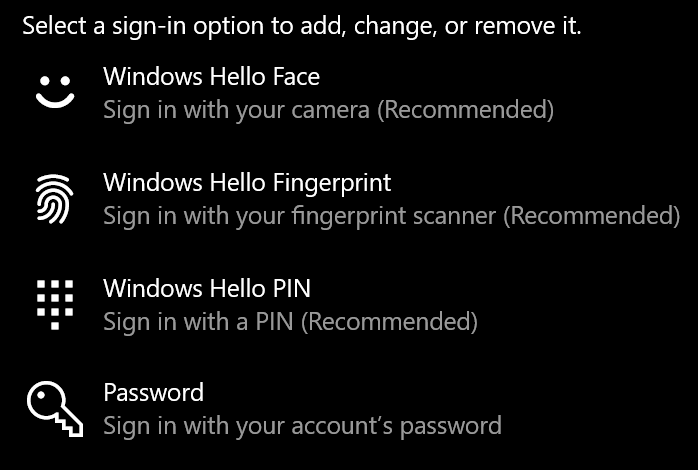
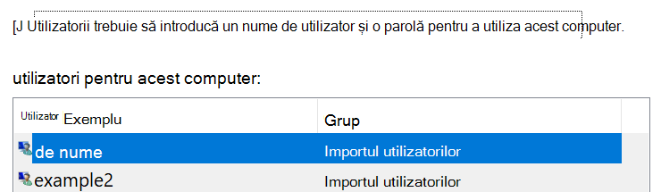

# Conectarea la Windows 10 fără a utiliza o parolă

Pentru a evita să tastați o parolă la pornirea Windows, vă recomandăm să utilizați una dintre opțiunile de conectare Windows Hello Secure, cum ar fi un cod PIN, o recunoaștere a feței sau o amprentă, dacă este disponibilă. Dacă doriți într-adevăr să dezactivați conectarea securizată, consultați instrucțiunile "conectați-vă automat la Windows 10" de mai jos.

**Securizați alternativele Windows Hello la parola contului**

Accesați **setări > conturi > opțiuni de conectare** (sau faceți clic [aici](ms-settings:signinoptions?activationSource=GetHelp)). Opțiunile de conectare disponibile vor fi listate. De exemplu:

Atingeți sau faceți clic pe una dintre opțiuni pentru a o configura. Data viitoare când porniți sau deblocați Windows, veți putea utiliza opțiunea nouă în locul unei parole. 

**Conectarea automată la Windows 10**

**Notă**: Conectarea automată este convenabilă, dar prezintă un risc de securitate, mai ales dacă PC-ul este accesibil de mai multe persoane. 

1. Atingeți sau faceți clic pe butonul **Start** în bara de activități.

2. Tastați **netplwiz** și apăsați tasta Enter pentru a deschide fereastra conturi utilizator.

3. În **conturile de utilizator**, faceți clic pe contul la care doriți să vă conectați automat atunci când pornește Windows.

4. Debifați caseta de selectare "utilizatorii trebuie să introducă un nume de utilizator și o parolă pentru a utiliza acest computer".

    

5. Faceți clic pe **OK**. Vi se va solicita să introduceți și să confirmați parola pentru contul pe care l-ați selectat. Faceți clic pe **OK** pentru a termina. Data viitoare când pornește Windows 10, acesta se va conecta automat la contul pe care l-ați selectat.
