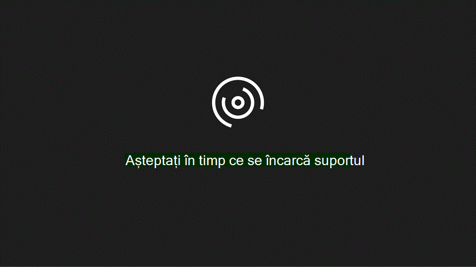

# Configurarea domeniului și utilizatorilor

Atunci când sunteți gata să configurați domeniul și utilizatorii, urmăriți acest videoclip rapid:
  

  
Pentru mai multe informații, consultați [Întrebări frecvente despre domenii.](https://docs.microsoft.com/microsoft-365/admin/setup/domains-faq)