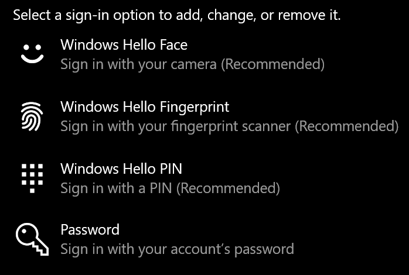

# Utilizarea opțiunii de deblocare a amprentelor în Windows 10

**Activarea amprentelor Windows Hello**

Pentru a debloca Windows 10 folosind amprenta, trebuie să configurați amprentă Windows Hello adăugând (permițând ca Windows să învețe să recunoască) cel puțin un deget. 

1. Accesați Setări **> Conturi > Opțiuni de conectare (sau faceți** clic [aici](ms-settings:signinoptions?activationSource=GetHelp)). Vor fi listate opțiunile disponibile de conectare. De exemplu:

    

2. Faceți clic sau **atingeți Amprentă Windows Hello**, apoi faceți clic pe **Instalare**. În fereastra de instalare Windows Hello, faceți **clic pe Incepeți.** Senzorul de amprente se va activa și veți fi întrebat dacă puneți degetul pe senzor:

   

3. Urmați instrucțiunile, care vă vor solicita să scanați în mod repetat cu degetul. Când se termină aceasta, veți avea opțiunea de a adăuga alte degete pe care poate doriți să le utilizați pentru conectare. Data viitoare când vă conectați la Windows 10, veți avea opțiunea de a utiliza amprenta pentru a face acest lucru.

**Amprentă Windows Hello nu este disponibilă ca opțiune de conectare**

Dacă amprentă Windows Hello nu este afișată ca opțiune de opțiuni de conectare, înseamnă că Windows nu cunoaște niciun cititor de amprente sau scaner atașat la PC sau că o politică de sistem împiedică utilizarea acesteia (de exemplu, **PC-ul** este gestionat de locul de muncă). Pentru a depana: 

1. Selectați **butonul Start** din bara de activități și căutați Manager **dispozitive**.

2. Atingeți sau faceți clic pentru a **deschide Manager dispozitive**.

3. În Manager dispozitive, extindeți Dispozitivele biometrice, făcând clic pe ghilimelele unghiulare.

   

4. Scanerul de amprente ar trebui să fie listat ca dispozitiv biometric, cum ar fi scanerul de sindicalizare WBDI:

   

5. Dacă scanerul de amprente nu este afișat și scanerul este integrat în PC, accesați site-ul web al producătorului PC-ului. În secțiunea de asistență tehnică pentru modelul PC, căutați un driver Windows 10 pentru un scaner pe care să îl puteți instala.

6. Dacă scanerul este separat de PC (atașat prin USB), accesați site-ul web al producătorului scanerului pentru a găsi și a instala software-ul de driver de dispozitiv Windows 10 pentru modelul de scaner pe care îl aveți.
