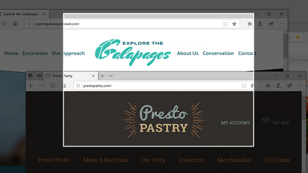
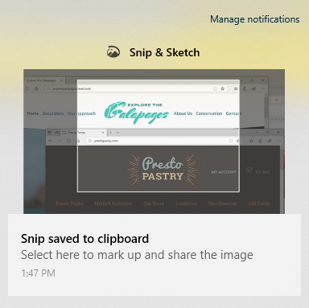

# Utilizați Decup & schiță pentru a captura, a marca și a partaja imaginiUse Snip & Sketch to capture, mark up, and share images

Schița de ecran se numește acum **Schiță de & decupare**.Screen sketch is now called **Snip & Sketch**. **Pentru a prelua rapid un decupaj:****To quickly take a snip**:

1. Apăsați **tasta siglă Windows + Shift + S**. Veți vedea ecranul întunecat și cursorul afișat ca o cruce.Press the **Windows logo key + Shift + S**. You'll see your screen darken and your cursor displayed as a cross. 

2. Alegeți un punct de la marginea zonei pe care doriți să o copiați și faceți clic stânga pe cursor.Choose a point at the edge of the area you want to copy and left-click the cursor. 

3. Mutați cursorul pentru a evidenția zona pe care doriți să o capturați.Move your cursor to highlight the area you want to capture. Zona pe care o capturați va apărea pe ecran.The area you capture will appear on your screen.

   

Imaginea decupată este salvată în clipboard, gata pentru a fi lipită într-un e-mail sau într-un document.The image you snipped is saved to your clipboard, ready for pasting into an email or document. 

**Dacă doriți să editați sau să vizualizați imaginea:****If you want to edit or view the image**: 

- Faceți clic pe pictograma notificări din extremita dreaptă a barei de activități; apoi faceți clic pe imaginea pe care tocmai ați capturat-o.Click the notifications icon at the far right side of the taskbar; then click the picture you have just captured. Decupajul se deschide în aplicația Decupare & Schiță.Your snip opens in the Snip & Sketch app.

   
