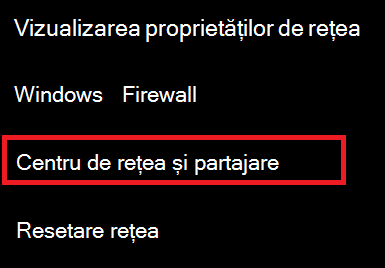
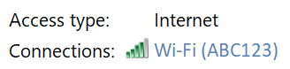
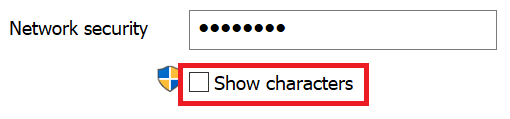

# Vizualizarea Wi-Fi parola de rețea în Windows 10View Wi-Fi network password in Windows 10

1. Asigurați-vă că PC-ul Windows 10 este conectat Wi-Fi rețea.Make sure your Windows 10 PC is connected to the Wi-Fi network.

2. Accesați Setări **> Network & Internet > Status** sau faceți clic  sau atingeți aici pentru a vă duce acolo acum.)Go to **Settings  > Network & Internet  > Status**, or click or tap [here](ms-settings:network?activationSource=GetHelp) to let us take you there now.)

3. Faceți **clic pe Centru rețea și partajare.**Click **Network and Sharing Center**.

    

4. În **Centru rețea și** partajare , lângă **Conexiuni**, veți vedea numele rețelei wireless.In **Network and Sharing Center**, next to **Connections**, you will see the name of your wireless network. De exemplu, dacă rețeaua este denumită "ABC123", este posibil să vedeți:For example, if your network is named "ABC123," you might see:

    

    Faceți clic pe numele rețelei wireless pentru a Wi-Fi fereastra Stare.Click the wireless network name to open the Wi-Fi Status window. 

5. În fereastra Wi-Fi Stare, faceți clic **pe Proprietăți wireless**, faceți clic pe **fila** Securitate și bifați **Afișare caractere**.In the Wi-Fi Status window, click **Wireless Properties**, click the **Security** tab, and check **Show characters**.

    

